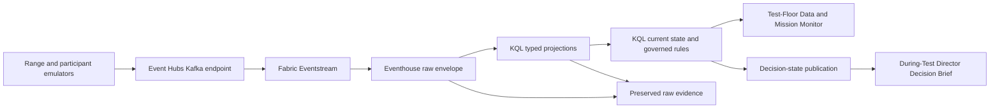

# Demo 04 Live Operations Design

## Purpose

Demo 04 should show a credible during-test operating loop, not a dashboard that
merely refreshes quickly. It must distinguish what the test floor observes,
what engineers infer, and what the test director is authorized to decide.

The live experience has two products:

1. **Test-Floor Data and Mission Monitor** - a Real-Time Dashboard used by test
   engineers to understand incoming events, identify data or participant
   anomalies, and verify recovery.
2. **During-Test Director Decision Brief** - the existing Power BI report used
   to summarize decision posture, objective impact, accountability, and the
   preserved evidence record.

Neither product automatically declares `GO` or `NO-GO`. Test control records a
recommendation, and the named decision authority records the decision.

## Operating Flow

### Data path

- Eventstream receives the approved Kafka envelope and routes every event to
  `RawIntegratedTestEvents`.
- Transactional KQL update policies maintain typed event tables.
- KQL functions or materialized views maintain current source status, active
  command expectations, participant state, test markers, and rule results.
- A heartbeat from test control advances authoritative time even when a
  participant is silent. Silence can then become `STALE` or `OVERDUE` without
  requiring another business event from that participant.
- The Real-Time Dashboard queries Eventhouse directly for floor latency.
- The director brief receives governed decision-state snapshots and preserved
  evidence. It is not the primary second-by-second monitoring surface.

## Credibility Contract

Every screen must display:

- Mode: `LIVE`, `REPLAY`, `PAUSED`, or `STALE`.
- Test name, event identifier, phase, planned execution time, and decision gate.
- Sites and participants in scope, including active filters.
- Authoritative clock time, latest event time, latest receipt time, and lag.
- Expected sources, reporting sources, stale sources, and missing sources.
- Rule-set version and whether thresholds are approved or synthetic.
- Authoritative-source status and the named decision authority.

Replay data must never age against the wall clock. Replay currency is measured
against the replay cursor. Live currency is measured against the authoritative
test-control clock.

## Test-Floor Data and Mission Monitor

### Fixed header

- Mode and connection state.
- Test, phase, site scope, and authoritative time.
- Latest event and receipt times.
- `Reporting / Expected` sources and the oldest active source age.

### Source matrix

One row per expected source instance:

| Field | Meaning |
| --- | --- |
| Participant / instrument | Operational source name |
| Site | Synthetic or approved operational association |
| Participant state | Reported operating and readiness state |
| Feed state | `REPORTING`, `LATE`, `STALE`, `MISSING`, or `INVALID` |
| Last event | Source event time |
| Last receipt | Fabric receipt time |
| Lag | Receipt time minus event time |
| Sequence | Latest sequence and detected gap |
| Clock | Synchronization state and offset |
| Objective | Objectives requiring this source |

Participant state and feed state remain separate. A missing feed does not prove
a failed participant, and a healthy feed does not prove participant readiness.

### Event and command timeline

- Test markers establish phase changes and the current observation window.
- Command transactions appear as correlated chains: publication, assignment,
  acknowledgment, execution, and completion.
- Active expectations show a countdown to their due time.
- A pending expectation becomes `OVERDUE` only after the authoritative clock
  passes its deadline.
- Late, duplicate, malformed, out-of-order, and missing events have distinct
  labels and visual treatment.

### Active anomaly queue

Rank by test impact, then age:

- `FLOOR ACTION` - investigate now; an objective may become unevaluable.
- `WATCH` - degraded or approaching a threshold.
- `INFORMATIONAL` - retained for reconstruction but no immediate action.

Each row shows participant, site, affected objective, observation, competing
explanations, measured value, threshold, first observed time, owner, next check,
due time, and recovery indication.

### Evidence inspection

Selecting an anomaly opens its correlated sequence without changing the fixed
header totals. The engineer can compare raw and typed events, event and receipt
times, source instance, sequence, correlation identifiers, rule version, and
preservation status.

## During-Test Director Decision Brief

The opening page must support this sequence in less than 60 seconds:

1. Identify the test, phase, location context, decision gate, and data currency.
2. State `GO`, `NO-GO`, `HOLD`, or `NO DECISION`, the recommending organization,
   and the named authority.
3. Name no more than three blocking conditions and their objective or schedule
   effects.
4. State what opened, closed, improved, or worsened since the previous brief.
5. Give each recovery owner, exact deadline, recovery forecast, and escalation.
6. Show whether supporting records are attached, validated, and adjudicated.

The director page does not show raw event identifiers, sequence keys, platform
components, or technical source counts unless they explain decision confidence.

## State Semantics

### Feed state

| State | Rule |
| --- | --- |
| `REPORTING` | Latest valid receipt is within the approved freshness threshold |
| `LATE` | Event arrived after its latency threshold |
| `STALE` | No valid event within the freshness threshold while the source is expected |
| `MISSING` | Required source has produced no valid event in the active phase |
| `INVALID` | Event arrived but failed the approved contract |

### Expectation state

| State | Rule |
| --- | --- |
| `PENDING` | Deadline has not passed and no qualifying response is observed |
| `RECEIVED` | Qualifying response arrived by the deadline |
| `LATE` | Qualifying response arrived after the deadline |
| `OVERDUE` | Authoritative time passed the deadline without a qualifying response |
| `UNDETERMINED` | Replay or observation window ended before the deadline |

The current replay acknowledgment is `UNDETERMINED`, not an operationally
pending transaction: the replay ends at `14:05:05Z`, twenty seconds before its
`14:05:25Z` deadline.

## Demonstration Sequence

1. Start in `LIVE` with all six expected sources reporting.
2. Show nominal event flow and a correlated command transaction.
3. Delay one command so latency moves from nominal to `LATE`.
4. Skip one TPY2 sequence and stop its heartbeat so the engineer sees a gap,
   then a stale source, without declaring the participant failed.
5. Publish an assignment and show its acknowledgment countdown.
6. Send the acknowledgment either before or after the deadline to demonstrate
   a defensible state transition.
7. Send one duplicate and one malformed record to prove preservation and
   canonical handling without overstating mission impact.
8. Restore the source, show the recovery indication, and publish the changed
   decision-state snapshot to the director brief.
9. Drill from the brief to the preserved event sequence.

## Acceptance Criteria

Live mode is credible only when all of the following are demonstrated:

- The Eventstream source and Eventhouse destination are published and running.
- A generated event appears in the floor dashboard within the stated latency.
- Mode, clock, phase, scope, filters, and source denominator are visible.
- A heartbeat advances deadlines during source silence.
- Acknowledgment transitions are demonstrated for `RECEIVED`, `LATE`, and
  `OVERDUE`; truncated replay produces `UNDETERMINED`.
- Participant health and feed health are shown independently.
- Every floor action links to objective, owner, due time, next check, and raw
  preserved evidence.
- The director brief shows an authoritative decision state or explicitly says
  `NO DECISION` and names the missing authority or evidence.
- Opening, closing, improving, and worsening conditions are visible between
  decision snapshots.
- Replay and live modes use the same event contract and visibly different
  currency semantics.

## Implementation Order

1. Bind the Eventstream to the emulator's Event Hubs Kafka endpoint and
   `RawIntegratedTestEvents`.
2. Add a test-control heartbeat and explicit phase markers.
3. Move current-state, expectation, and governed finding evaluation into KQL.
4. Build the Test-Floor Data and Mission Monitor over Eventhouse.
5. Publish governed decision snapshots and trend deltas for Power BI.
6. Run the demonstration sequence and capture latency, state-transition, and
   evidence-lineage results before labeling the experience `LIVE`.